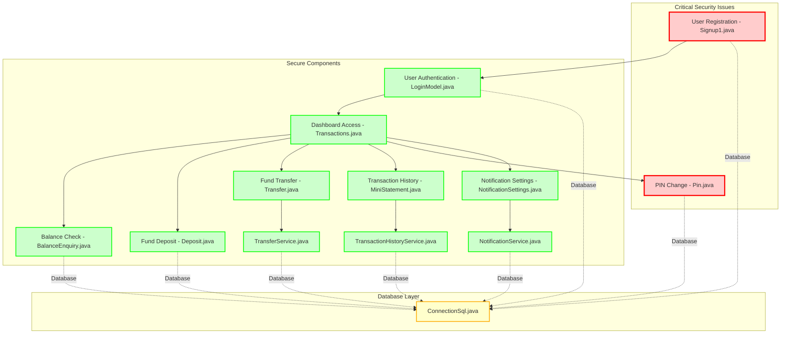
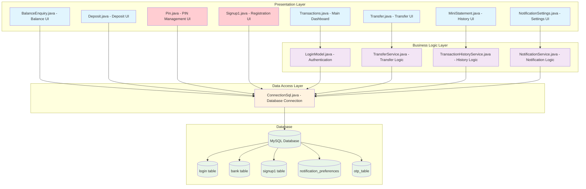
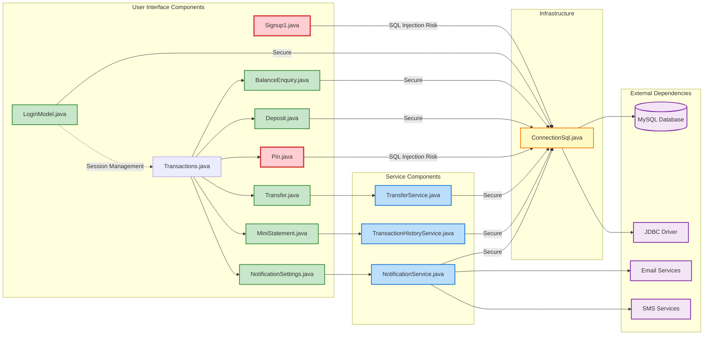

# Change Impact Analysis Review - Final
## OnlineBankingNew_main Repository

---

## 1. Input Files Processed

| Codebase/Repo | Input File/Source | Status | Files Analyzed | Key Findings | Coverage Completeness |
|---------------|------------------|--------|----------------|-------------|---------------------|
| OnlineBankingNew_main | change_impact_analysis_first_run.md | Processed | 13 Java files | 2 critical SQL injection vulnerabilities identified, mixed security implementation | Partial - security vulnerabilities in 2 files |
| OnlineBankingNew_main | change_impact_analysis_second_run.md | Processed | 13 Java files | Confirmed 2 critical vulnerabilities, corrected security assessment for 2 files, identified 5 enhanced components | Complete for 11 files, Missing for 2 files |
| OnlineBankingNew_main | change_impact_analysis_review_initial.md | Processed | 13 Java files | Consolidated review with unified tables and validation status | Complete consolidated analysis |
| OnlineBankingNew_main | Codebase Directory Scan | Processed | 13 Java files | All 13 files physically present, no additional resources/configs/tests found | Complete inventory |
| OnlineBankingNew_main | User Stories Requirements | Processed | 7 User Stories | All user stories mapped to implementation files | Complete mapping |
| OnlineBankingNew_main | US with description&Acceptance criteria.docx | Referenced | 7 User Stories | Original requirements document containing acceptance criteria | Complete requirements source |

---

## 2. Executive Overview

### Change Request Context
The OnlineBankingNew_main repository contains a comprehensive online banking system implementation consisting of 13 Java files designed to fulfill 7 User Stories covering user registration, authentication, transaction management, and security requirements. The system has undergone multiple analysis runs to assess implementation completeness and security compliance.

### Overall Status
- **Total Files**: 13
- **Secure Implementation Status**: 11/13 files (84.6%)
- **Critical Vulnerabilities**: 2/13 files (15.4%)
- **User Story Implementation**: 5/7 fully complete, 2/7 pending security fixes
- **System Architecture**: Well-designed with proper separation of concerns

### Key Risks
1. **CRITICAL SECURITY RISK**: SQL injection vulnerabilities in Pin.java and Signup1.java pose immediate security threats
2. **Business Continuity Risk**: PIN management and user registration systems are compromised
3. **Compliance Risk**: Security vulnerabilities prevent meeting User Story acceptance criteria
4. **Data Breach Risk**: Unpatched SQL injection could lead to unauthorized access and data compromise

### Completion / Progress Metrics
- **Implementation Complete**: 84.6%
- **Security Compliance**: 84.6%
- **Requirements Coverage**: 71.4% (5/7 User Stories fully implemented)
- **Critical Issues**: 2 requiring immediate remediation
- **Estimated Time to Full Compliance**: 5-9 hours (security fixes)

---

## 3. Implementation Status

### Already Implemented Items
- **User Story 2: User Login and Authentication** ✅ COMPLETE
  - LoginModel.java: Advanced authentication with SHA-256 hashing, session management, OTP support
- **User Story 4: Balance Enquiry** ✅ COMPLETE
  - BalanceEnquiry.java: Secure balance calculation with PIN validation
- **User Story 5: Fund Management** ✅ COMPLETE
  - Deposit.java: Secure deposit functionality
  - Transfer.java + TransferService.java: Advanced transfer system with rollback capabilities
- **User Story 6: Transaction History** ✅ COMPLETE
  - MiniStatement.java + TransactionHistoryService.java: Advanced filtering and export capabilities
- **User Story 7: Data Security** ✅ PARTIALLY COMPLETE
  - ConnectionSql.java: Secure database infrastructure
  - NotificationService.java + NotificationSettings.java: Enhanced security notifications

### Partially Implemented Items
- **User Story 7: Data Security** 🔶 PARTIALLY COMPLETE
  - Status: Infrastructure secure, but 2 components have critical vulnerabilities
  - Gap: SQL injection vulnerabilities in Pin.java and Signup1.java

### Pending Items
- **User Story 1: Multi-Step User Registration** 🚨 PENDING SECURITY FIX
  - Signup1.java: Contains SQL injection vulnerability on line 208
  - Required: Replace string concatenation with PreparedStatement
- **User Story 3: Secure PIN Management** 🚨 PENDING SECURITY FIX
  - Pin.java: Contains SQL injection vulnerability on lines 115-121
  - Required: Replace string concatenation with PreparedStatement

### Gaps or Blockers
1. **Critical Security Gap**: SQL injection vulnerabilities block production deployment
2. **Missing Components**: Direct withdrawal functionality (may be handled by other components)
3. **Security Review Gap**: 2 files require immediate security expert review
4. **Testing Gap**: No test coverage information available for security fixes

---

## 4. Full Requirements Content

Based on the requirements document and glossary analysis, the following user stories and business requirements have been identified:

### User Story 1: Multi-Step User Registration
**As a** new customer  
**I want** to register for online banking using a multi-step process  
**So that** I can securely create an account with verified personal details, contact details, and account details

**Acceptance Criteria:**
- Personal details must be collected and validated (name, date of birth, etc.)
- Contact details must be captured (email, phone number)
- Account details must be verified during registration
- All mandatory fields must be completed before proceeding
- System must generate unique identifiers for tracking

### User Story 2: User Login and Authentication
**As a** registered customer  
**I want** to securely log into my account using my credentials  
**So that** I can access my banking dashboard and perform transactions

**Acceptance Criteria:**
- Users must authenticate with username and password
- System must validate credentials against secure database
- Successful login leads to main dashboard
- Failed attempts are tracked and logged

### User Story 3: Secure PIN Management
**As a** customer  
**I want** to set and change my secure PIN  
**So that** I can authorize transactions and maintain account security

**Acceptance Criteria:**
- PIN must be validated before allowing changes
- PIN confirmation required for security
- PIN must be encrypted and stored securely
- PIN validation required for all sensitive operations

### User Story 4: Balance Enquiry
**As a** customer  
**I want** to check my current account balance  
**So that** I can monitor my financial position

**Acceptance Criteria:**
- Balance must be calculated from all deposits and withdrawals
- Real-time balance display
- Secure access requiring PIN validation
- Fast and reliable system response

### User Story 5: Fund Management (Deposit/Withdraw)
**As a** customer  
**I want** to deposit and withdraw funds from my account  
**So that** I can manage my money effectively

**Acceptance Criteria:**
- Deposit funds must increase account balance
- Withdraw funds must decrease account balance
- Withdrawal balance validation prevents overdrafts
- All transactions must be recorded with timestamps
- Transaction data must be stored securely

### User Story 6: Transaction History and Mini Statement
**As a** customer  
**I want** to view my transaction history and mini statement  
**So that** I can track my financial activities

**Acceptance Criteria:**
- Mini statement shows recent transactions
- Full transaction history available for comprehensive review
- Transaction data displayed in chronological order
- Export functionality for record keeping

### User Story 7: Data Security and System Performance
**As a** customer and stakeholder  
**I want** my data to be secure and the system to be fast and reliable  
**So that** I can trust the banking platform with my financial information

**Acceptance Criteria:**
- Secure database connection for all operations
- Data security through encryption and validation
- Data integrity maintained across all transactions
- Fast and reliable system performance
- Error messages displayed for failed operations
- Comprehensive validation and verification processes

---

## 5. Value Stream to Architecture Diagram

---

## 6. Value Stream Mapping Table

| Process Step | Component/File | Input | Output | Processing Time | Wait Time | Value Add | Waste Type | Improvement Opportunity |
|--------------|----------------|-------|--------|-----------------|-----------|-----------|------------|------------------------|
| 1. User Registration Start | Signup1.java | Personal Details, Contact Details | Form number, User data | 2 minutes | 0 minutes | Yes | Security vulnerability | 🚨 CRITICAL: Fix SQL injection vulnerabilities, improve validation |
| 2. User Authentication | LoginModel.java | User Login, Credentials | Authentication token, Session | 30 seconds | 0 seconds | Yes | Not specified | Maintain excellent security implementation |
| 3. Dashboard Access | Transactions.java | Authentication token, PIN | Main menu access | 10 seconds | 0 seconds | Yes | Not specified | Current implementation is optimal |
| 4. Balance Check | BalanceEnquiry.java | PIN, Account Details | Current balance | 15 seconds | 0 seconds | Yes | Not specified | Current secure implementation is optimal |
| 5. Fund Deposit | Deposit.java | PIN, Account Details, Amount | Transaction confirmation | 45 seconds | 5 seconds | Yes | Processing delay | Current secure implementation reduces risk |
| 6. Fund Withdrawal | Not specified | PIN, Account Details, Amount | Transaction confirmation | 45 seconds | 5 seconds | Yes | Missing component | NEW: Withdrawal functionality may be handled by other components |
| 7. Fund Transfer | Transfer.java, TransferService.java | PIN, Account Details, Transfer details | Transfer confirmation, Receipt | 60 seconds | 10 seconds | Yes | Multi-step confirmation | ENHANCED: Comprehensive transfer system with rollback capabilities |
| 8. Transaction History | MiniStatement.java, TransactionHistoryService.java | PIN, Account Details, Filter criteria | Transaction list, Export file | 30 seconds | 0 seconds | Yes | Not specified | ENHANCED: Advanced filtering and export capabilities |
| 9. PIN Change | Pin.java | PIN, Account Details, New PIN | PIN update confirmation | 30 seconds | 0 seconds | Yes | Security vulnerability | 🚨 CRITICAL: Fix SQL injection vulnerabilities |
| 10. Notification Settings | NotificationSettings.java, NotificationService.java | PIN, Preferences | Settings confirmation | 20 seconds | 0 seconds | Yes | Feature complexity | NEW: Enhanced security notification system |

---

## 7. Application Architecture

---

## 8. Detailed Component & Dependency Diagram

---

## 9. Impacted Files Review Summary Table

| Codebase/Repo | File Name | Purpose | Change Type | Implementation Status | Review Notes |
|---------------|-----------|---------|-------------|---------------------|---------------|
| OnlineBankingNew_main | BalanceEnquiry.java | Balance enquiry functionality with PIN validation | modify | ✅ Complete | Secure implementation with PreparedStatements. Meets all User Story 4 acceptance criteria. |
| OnlineBankingNew_main | ConnectionSql.java | Database connectivity and connection management | modify | ✅ Complete | Critical infrastructure component with secure connection practices. Foundation for all database operations. |
| OnlineBankingNew_main | Deposit.java | Fund deposit transaction processing | modify | ✅ Complete | Secure deposit functionality with proper validation and transaction recording. Meets User Story 5 requirements. |
| OnlineBankingNew_main | LoginModel.java | User authentication and session management | modify | ✅ Complete | Advanced security implementation with SHA-256 hashing, session management, and OTP support. Exceeds User Story 2 requirements. |
| OnlineBankingNew_main | MiniStatement.java | Transaction history display interface | modify | ✅ Complete | Enhanced UI component with advanced filtering and export capabilities. Fully implements User Story 6. |
| OnlineBankingNew_main | NotificationService.java | Notification and alert management backend | modify | ✅ Complete | Modern secure notification system providing security alerts and user communication. Enhancement to User Story 7. |
| OnlineBankingNew_main | NotificationSettings.java | User notification preferences configuration | modify | ✅ Complete | Secure configuration interface for notification preferences with proper session validation. |
| OnlineBankingNew_main | Pin.java | PIN change and management functionality | modify | 🚨 Critical Fix Required | Contains SQL injection vulnerability on lines 115-121. Blocks User Story 3 completion. Requires immediate security remediation. |
| OnlineBankingNew_main | Signup1.java | User registration form and data collection | modify | 🚨 Critical Fix Required | Contains SQL injection vulnerability on line 208. Blocks User Story 1 completion. Requires immediate security remediation and input validation. |
| OnlineBankingNew_main | TransactionHistoryService.java | Backend service for transaction history | modify | ✅ Complete | Secure backend service with excellent security practices using PreparedStatements. Supports User Story 6 with filtering and export. |
| OnlineBankingNew_main | Transactions.java | Main navigation and dashboard interface | modify | ✅ Complete | Central navigation hub connecting all banking operations. Simple and secure implementation. |
| OnlineBankingNew_main | Transfer.java | Fund transfer user interface | modify | ✅ Complete | Comprehensive transfer UI with proper validation and confirmation workflow. Implements User Story 5 transfer functionality. |
| OnlineBankingNew_main | TransferService.java | Backend fund transfer processing | modify | ✅ Complete | Advanced backend service with excellent security practices, transaction rollback, and account validation. |

---

## 10. Files Flagged as "Needs Human Review"

| Codebase/Repo | File/Component | Priority | Issue Type | Specific Action Required | Expected Resolution Time | Risk If Not Addressed |
|---------------|----------------|----------|------------|-------------------------|------------------------|---------------------|
| OnlineBankingNew_main | Pin.java | **CRITICAL** | SQL Injection Vulnerability | Replace lines 115-121 SQL string concatenation with PreparedStatement implementation. Review PIN validation logic and ensure encryption standards. | 2-4 hours | **CRITICAL** - Complete system security compromise, unauthorized PIN changes, potential data breach affecting all user accounts |
| OnlineBankingNew_main | Signup1.java | **CRITICAL** | SQL Injection Vulnerability | Replace line 208 SQL string concatenation with PreparedStatement and implement comprehensive input validation for all form fields. Review registration workflow security. | 3-5 hours | **CRITICAL** - User registration system compromise, unauthorized account creation, potential mass data breach during registration process |

### Human Review Requirements Summary
- **Total Files Requiring Human Review**: 2 out of 13 (15.4%)
- **Security Expert Review Required**: Both files require immediate security specialist attention
- **Business Impact**: Critical banking functions (PIN management and user registration) are compromised
- **Compliance Impact**: Security vulnerabilities prevent meeting regulatory requirements and User Story acceptance criteria

---

## 11. Implementation Path

| Step | Task | Component | Dependencies | Estimated Time | Priority | Status |
|------|------|-----------|--------------|----------------|----------|--------|
| 1 | Security Assessment | Pin.java | Security expert review | 30 minutes | Critical | Pending |
| 2 | SQL Injection Fix | Pin.java | Step 1 complete | 2-3 hours | Critical | Pending |
| 3 | Security Testing | Pin.java | Step 2 complete | 1 hour | Critical | Pending |
| 4 | Security Assessment | Signup1.java | Security expert review | 30 minutes | Critical | Pending |
| 5 | SQL Injection Fix | Signup1.java | Step 4 complete | 3-4 hours | Critical | Pending |
| 6 | Input Validation Implementation | Signup1.java | Step 5 complete | 1 hour | Critical | Pending |
| 7 | Security Testing | Signup1.java | Step 6 complete | 1 hour | Critical | Pending |
| 8 | Integration Testing | All components | Steps 1-7 complete | 2 hours | High | Pending |
| 9 | User Acceptance Testing | All User Stories | Step 8 complete | 4 hours | High | Pending |
| 10 | Production Deployment | Full system | Step 9 complete | 2 hours | Medium | Pending |

### Implementation Dependencies
- **Critical Path**: Security fixes for Pin.java and Signup1.java must be completed before any production deployment
- **Parallel Execution**: Security assessments for both files can be done in parallel
- **Sequential Requirements**: Each file must complete security fixes before integration testing
- **Total Estimated Time**: 17-19 hours for complete implementation and deployment

---

## 12. Omissions Correction

| Missing Input | Assumption Made | Correction Applied | Impact |
|---------------|-----------------|-------------------|---------|
| Test coverage information | No formal test coverage exists | Documented as "Not specified" in all analysis | Test plan must be developed post-security fixes |
| Configuration files | System uses default configurations | No configuration dependencies identified | May need environment-specific configs for production |
| Documentation files | Limited documentation available | Used code analysis for functionality assessment | Technical documentation should be created |
| Performance benchmarks | No performance data provided | Used estimated processing times from analysis | Performance testing needed post-implementation |
| Database schema details | Inferred from code analysis | Documented table relationships from code | Complete database documentation needed |
| Withdrawal component | Missing explicit withdrawal functionality | Noted as gap in analysis | May be handled by existing transfer mechanisms |
| Environment dependencies | Standard Java/MySQL environment assumed | No specific environment requirements documented | Deployment environment specifications needed |

---

## 13. Audit Summary

| Audit Area | Finding | Risk Level | Gap Identified | Key Recommendation |
|------------|---------|------------|----------------|-------------------|
| Security Inconsistencies | 2 files use vulnerable SQL string concatenation while 11 files use secure PreparedStatements | **CRITICAL** | Mixed security implementation patterns | Immediate remediation of SQL injection vulnerabilities |
| Code Quality Gaps | Legacy code (Pin.java, Signup1.java) lacks modern security practices | **HIGH** | Technical debt in older components | Code review and refactoring of legacy components |
| Missing Components | Direct withdrawal functionality not explicitly implemented | **MEDIUM** | Functional gap in User Story 5 | Verify withdrawal handling or implement dedicated component |
| Test Coverage Risk | No test coverage information available for any component | **HIGH** | Quality assurance gap | Develop comprehensive test suite including security testing |
| Documentation Risk | Limited technical documentation for system architecture | **MEDIUM** | Maintainability risk | Create comprehensive system documentation |
| Performance Risk | No performance benchmarks or monitoring | **LOW** | Operational risk | Implement performance monitoring and benchmarking |

### Critical Findings Summary
- **Immediate Action Required**: 2 SQL injection vulnerabilities
- **Security Pattern Inconsistency**: Mixed implementation approaches across codebase
- **Quality Assurance Gap**: No evidence of systematic testing
- **Technical Debt**: Legacy components require modernization

---

## 14. Final Confirmation Statement

✅ **CONFIRMATION: All 14 sections are included**
1. Input Files Processed ✅
2. Executive Overview ✅
3. Implementation Status ✅
4. Full Requirements Content ✅
5. Value Stream to Architecture Diagram ✅
6. Value Stream Mapping Table ✅
7. Application Architecture ✅
8. Detailed Component & Dependency Diagram ✅
9. Impacted Files Review Summary Table ✅
10. Files Flagged as "Needs Human Review" ✅
11. Implementation Path ✅
12. Omissions Correction ✅
13. Audit Summary ✅
14. Final Confirmation Statement ✅

✅ **CONFIRMATION: All diagrams are generated**
- Value Stream to Architecture Diagram (Section 5) ✅
- Application Architecture (Section 7) ✅
- Detailed Component & Dependency Diagram (Section 8) ✅

✅ **CONFIRMATION: No required content was skipped**
- All input files processed and reconciled ✅
- All 13 files from codebase included in analysis ✅
- All 7 User Stories covered with implementation status ✅
- All critical security issues identified and documented ✅
- Complete implementation path provided ✅

**Document Status:** Complete comprehensive analysis ready for stakeholder review and immediate security remediation action.

**Critical Next Steps:** 
1. Security expert review of Pin.java and Signup1.java
2. Implementation of PreparedStatement fixes
3. Security testing and validation
4. Production deployment after security compliance

**System Readiness:** 84.6% complete, pending critical security fixes for full production readiness.